<!-- Custom animated brand banner — commit header.svg to this repo first -->
<p align="center">
  
</p>

<!-- Animated typing line -->
<p align="center">
  <a href="https://portfolioai.company">
    
  </a>
</p>

<p align="center">
  <a href="https://portfolioai.company"></a>
  <a href="https://www.linkedin.com/in/sagarrprajapati/"></a>
  <a href="mailto:sagarbmw1@gmail.com"></a>
</p>

<br/>

## 🚀 Flagship — [PortfolioAI](https://portfolioai.company)

> **An AI tool that turns resumes into live portfolio websites.** Designed, built, launched, and operated solo — running in production with 15+ users.

| | |
|---|---|
| **Frontend** | Next.js · React · Tailwind CSS |
| **Backend** | Supabase (PostgreSQL, RLS) · serverless on Vercel |
| **Payments** | Stripe — checkout, webhooks, payment-gated access |
| **AI** | Claude API — prompt-engineered structured HTML across 12 design palettes |
| **Ops** | Resend email automation · cron sequences · CI/CD |

**Production problems I've actually solved:**
- 🔒 Payment-gated content with row-level security, grace periods, and time-based preview expiry
- 🐛 Diagnosed and resolved a live recurring-billing defect through the Stripe API
- 🤖 LLM prompt engineering for deterministic, structured HTML output at generation time
- 📬 Automated conversion email pipeline that runs itself, daily

<br/>

## 🧠 Background

```text
💼  Full-stack .NET developer @ Scoopsense — C#, ASP.NET, SQL Server, production systems
🎓  Post-Bacc Diploma, Applied Data Science — Thompson Rivers University (GPA 3.96)
📜  Oracle Cloud Infrastructure 2025 Certified Data Science Professional
📜  NVIDIA — Fundamentals of Deep Learning
🔬  ML projects: LSTM demand forecasting (92% acc, Dockerized) · CNN vision · Power BI analytics
```

<br/>

## 🛠 Tech I actually use

<p>
  
  
  
  
  
  
  
  
  
  
  
  
  
  
  
  
  
</p>

<br/>

## 📊 Activity

<p align="center">
  
  
</p>

<br/>

<p align="center">
  <sub>📍 Kamloops, BC · 📫 sagarbmw1@gmail.com · open to full-stack & data-driven SDE roles</sub>
</p>
