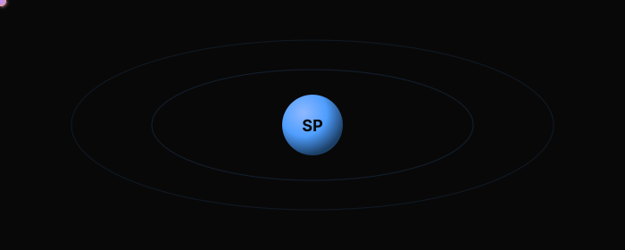

<!-- Animated brand banner — commit header.svg and orbit.svg alongside this file -->
<p align="center">
  
</p>

<p align="center">
  <a href="https://portfolioai.company">
    
  </a>
</p>

<p align="center">
  <a href="https://portfolioai.company"></a>
  <a href="./resume.pdf"></a>
  <a href="https://www.linkedin.com/in/sagarrprajapati/"></a>
  <a href="mailto:sagarbmw1@gmail.com"></a>
</p>

<br/>

## 👋 About me

I'm a full-stack developer and applied data scientist based in Kamloops, BC. I taught myself to ship — **PortfolioAI** is a real SaaS product I designed, built, and operate solo, from Stripe billing to production incident response. On the data side, I hold a Post-Baccalaureate Diploma in Applied Data Science (GPA 3.96) and have built forecasting, computer-vision, and NLP projects end-to-end.

**Currently looking for:** Full-Stack Developer or Data/ML roles · open to hybrid or remote · based in Kamloops, BC, Canada 🇨🇦

<br/>

## 🚀 Flagship project — [PortfolioAI](https://portfolioai.company)

> **An AI tool that turns resumes into live portfolio websites.** Designed, built, launched, and operated solo — 15+ signups since launch.

| | |
|---|---|
| **Frontend** | Next.js · React · Tailwind CSS |
| **Backend** | Supabase (PostgreSQL, Row-Level Security) · serverless on Vercel |
| **Payments** | Stripe — checkout, webhooks, payment-gated access |
| **AI** | Claude API — Opus for generation, Haiku for resume parsing, prompt-engineered structured HTML |
| **Ops** | Resend email automation · cron-based drip sequences · CI/CD |

**Production problems I've actually solved:**
- 🔒 Built a blur-gate paywall (5-minute preview window, 72-hour expiry) gating full portfolios behind a $4.99 unlock
- 🐛 Diagnosed and resolved a live Stripe recurring-billing defect, and a separate expired-live-key checkout outage, through the Stripe API and dashboard
- 🤖 Prompt-engineered deterministic, structured HTML generation across 12 design palettes, with rules to keep names legible and layouts free of AI-design clichés
- 🖼️ Shipped a full photo pipeline: upload → Supabase Storage → AI background handling → composited into the generated hero
- 🚑 Debugged and fixed a production incident where a native binary (ONNX runtime) crashed the resume-upload route on Vercel — rolled back, root-caused, and shipped a permanent fix
- 📬 Automated a multi-step conversion email sequence that runs on its own, daily

<br/>

## 🧪 More projects

| Project | What it does | Stack |
|---|---|---|
| **Smart Shift AI** | LSTM-based demand forecasting model, 92% accuracy, containerized for reproducible runs | Python · PyTorch · Docker |
| **Cricket Analytics Dashboard** | Interactive Power BI dashboard analyzing cricket performance data | Power BI · SQL |
| **LangChain Chatbot** | Conversational chatbot built on LangChain with a LLaMA2 backend | Python · LangChain · LLaMA2 |
| **CNN Waste Classifier** | Convolutional neural network that classifies waste images by category | Python · TensorFlow/CNN |
| **BERT Flight-Booking Assistant** | BERT-based conversational assistant for flight-booking queries | Python · BERT · NLP |

<br/>

## 🧠 Background

```text
💼  Jr. Application Developer @ Scoopsense, Mumbai — Oct 2022 – Aug 2023
    C#, ASP.NET, SQL Server — production systems
🎓  Post-Bacc Diploma, Applied Data Science — Thompson Rivers University (GPA 3.96)
📜  Oracle Cloud Infrastructure 2025 Certified Data Science Professional
📜  NVIDIA — Fundamentals of Deep Learning
```

<br/>

## 🛠 Tech stack

<p align="center">
  
</p>

<p>
  
  
  
  
  
  
  
  
  
  
  
  
  
  
  
  
  
</p>

<br/>

## 📊 Activity

<p align="center">
  
  
</p>
<p align="center">
  
</p>

<br/>

<p align="center">
  <sub>📍 Kamloops, BC · 📫 sagarbmw1@gmail.com · open to full-stack & data-driven SDE roles</sub>
</p>
